# Employee Tracker

## Description

Within a company, it is important to track all departments as well as the roles and employees within them. To keep track of all this data, employeers can use this program. Using MySQL, Node.js, and Inquirer, users can input and view their company's data. 

By creating this assignment, I was able to practice using MySQL. To practice, I implemented MySQL in both the local terminal and through Node.js's mysql2 package. This project was more difficult than the ones that I have done previously, but I had a lot of fun making it. 

## Table of Contents

- [Installation](#installation)
- [Usage](#usage)
- [Credits](#credits)
- [License](#license)
- [Badges](#badges)

## Installation

1. Click on green code button and copy the ssh link
2. Open up terminal or git bash, then navigate to where you want the repository to be placed.
3. Type out "git clone (ssh link)"
4. Be sure to install Node.js. Node.js is necessary to run this program. If you need to, download it from the [Node.js website](https://nodejs.org/en/download/).
5. Once you have installed Node.js, navigate to inside the 'employee-tracker' folder
6. Run 'npm install' or 'npm i' to install packages within package.json
7. Install MySQL on your local computer's terminal. You can download a compatible version on [MySQL's dowload website](https://dev.mysql.com/downloads/mysql/).

## Usage

Before you run this program, you need to create a database and tables using MySQL. Log into your terminal's MySQL by typing in 'mysql -u root -p' and entering your password when prompted. If this does not work, set your local machine to have the default user 'root' and try again.

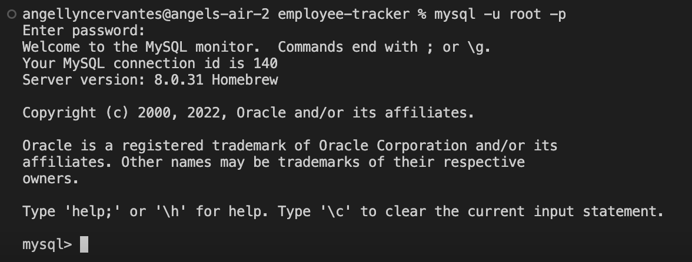

Copy and paste the code from 'schema.sql' (in the 'db' folder) into your terminal. 

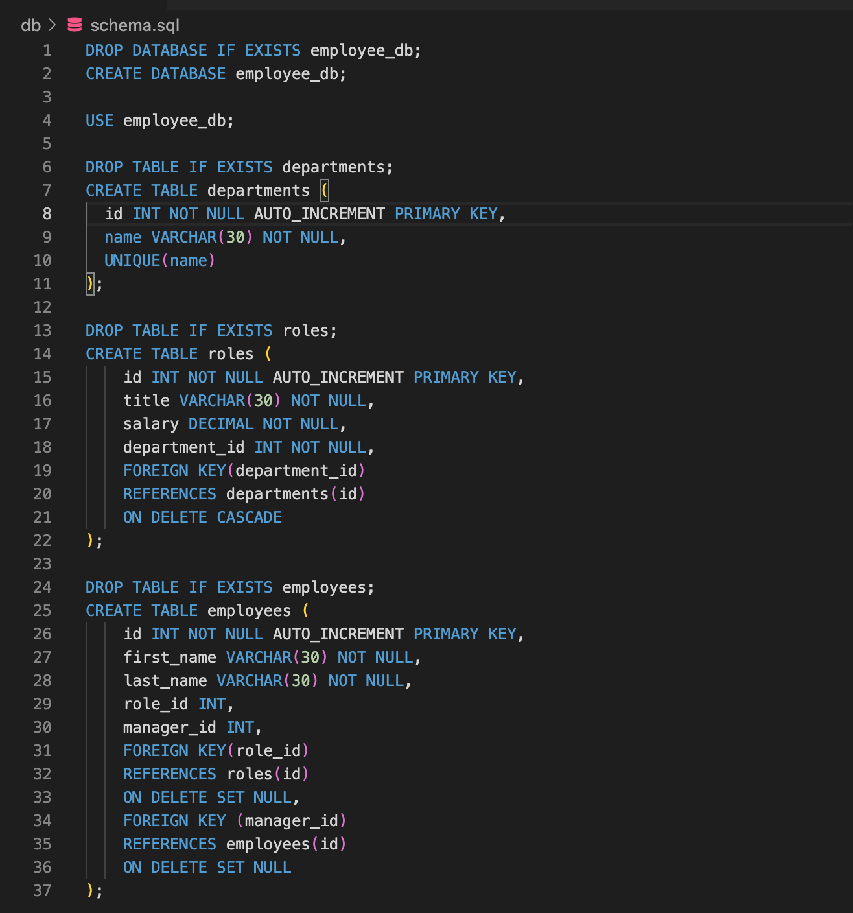

If you want to add sample data to the tables, you can copy and paste the provided data from seeds.sql (in the 'db' folder) into your terminal. However, this step is optional. Once you have finished adding to MySQL, type in '\q' and return to quit.

Now, start the Node.js program by navigating into your 'employee-tracker' folder and typing 'node index.js' into your terminal. This will bring up the main menu with a list of actions that this program allows you to do.

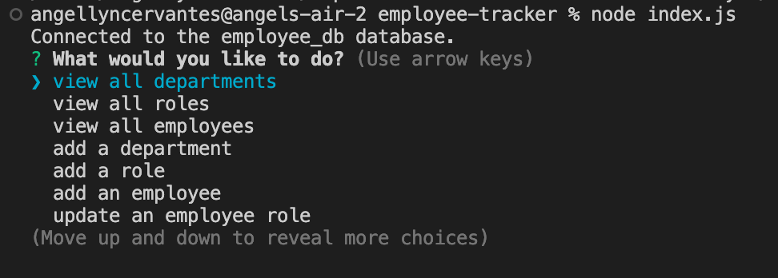

If you choose 'add a department', this will bring up a question asking for the department's name. Once you have answered this question, the department will be added to your departments table and you will be taken back to the main menu.

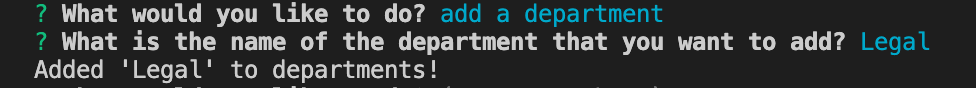

You can then view your newly added department by selecting 'view all departments' on the main menu. This option brings up the table of departments, then takes you back to the main menu.

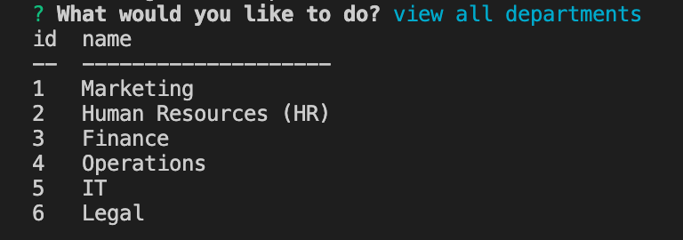

If you choose 'add a role', this will bring up questions to help the program create a role. Once you have answered these questions, the role will be added to your table of roles and you will be taken back to the main menu.

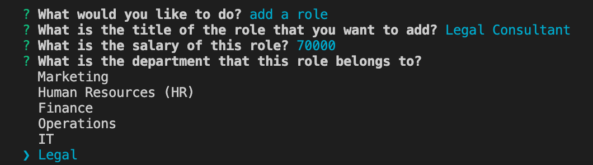

You can then view your newly added role by selecting 'view all roles' on the main menu. This option brings up the table of roles, then takes you back to the main menu.

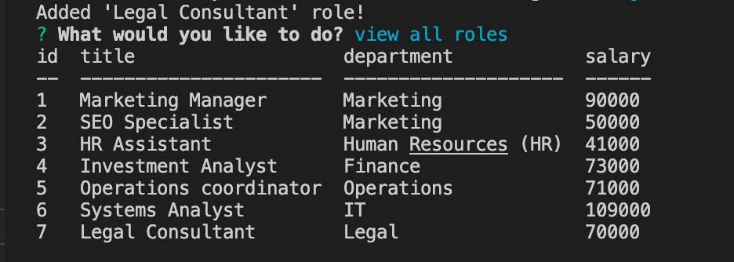

If you choose 'add an employee', this will bring up questions to help the program create an employee. Once you have answered these questions, the employee will be added to your table of employees and you will be taken back to the main menu.

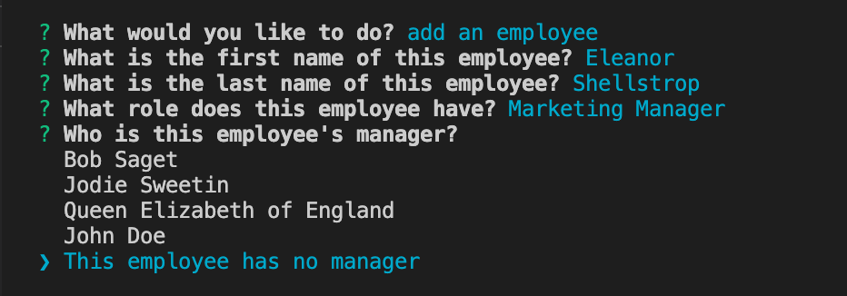

You can then view your newly added employee by selecting 'view all employees' on the main menu. This option brings up the table of employees, then takes you back to the main menu.

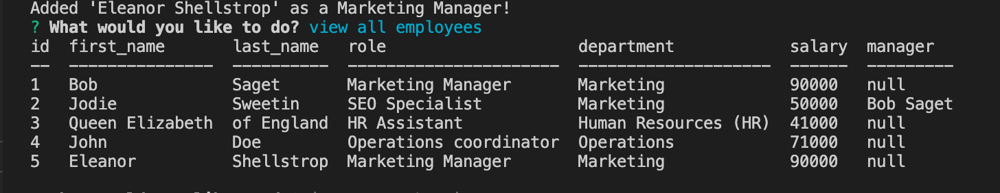

If want to update an employee's role, choose 'update an employee role'. This will bring up questions to help the program update an employee's role. Once you have answered these questions, the employee will be updated on the table of employees and you will be taken back to the main menu.

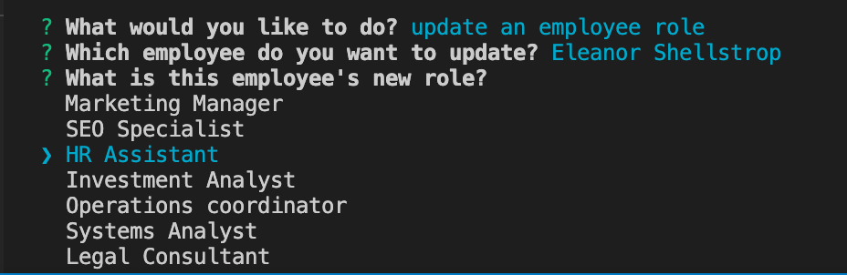

You can view your updated employee by selecting 'view all employees' on the main menu.

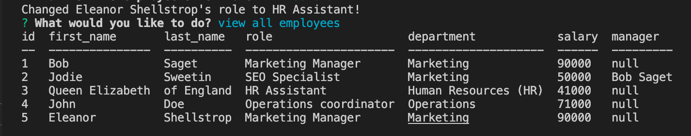

To quit the program, select 'quit' on the main menu. This will exit the program.

For a full walkthrough of this program, watch [this video](https://watch.screencastify.com/v/uoKtnSGUeJfA9XZpnOYR).

## Credits

console.table: https://www.npmjs.com/package/console.table

Unique mysql: https://www.w3schools.com/mysql/mysql_unique.asp 

Marketing Jobs: https://www.themuse.com/advice/high-paying-marketing-jobs, https://www.indeed.com/career-advice/finding-a-job/marketing-careers 

HR Jobs: https://www.rasmussen.edu/degrees/business/blog/human-resources-salaries/ 

Finance jobs: https://www.indeed.com/career-advice/pay-salary/finance-jobs-salary

Operations jobs: https://www.indeed.com/career-advice/finding-a-job/operations-job-titles 

IT jobs: https://www.coursera.org/articles/it-salaries-roles-location-and-experience 

switch statement: https://www.w3schools.com/js/js_switch.asp 

Select and join two tables' elements: https://stackoverflow.com/questions/10230438/mysql-join-2-tables

Order by: https://www.w3schools.com/mysql/mysql_orderby.asp 

Concat: https://www.w3schools.com/sql/func_mysql_concat.asp 

Join multiple tables: https://www.sqlshack.com/learn-sql-join-multiple-tables/

Include null in table: https://stackoverflow.com/questions/43907195/how-to-include-null-value-in-join 

IndexOf: https://www.w3schools.com/jsref/jsref_indexof_array.asp 

parseInt and non-numbers: https://stackoverflow.com/questions/6736476/how-to-turn-nan-from-parseint-into-0-for-an-empty-string 

## License

Please refer to LICENSE in this repository

## Badges

